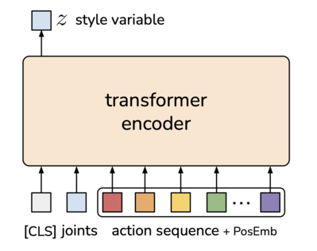
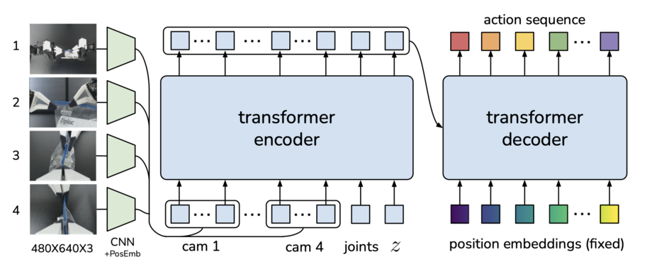

# ACT

Today we'll explore the neural-network approach called Action Chunking with Transformers (ACT). This imitation learning algorithm can achieve a success rate of around 90% in real-world tasks with just 10 minutes of demonstration data
## Imitation Learning
Imitation learning is a technique where robots learn to perform tasks by mimicking human demonstrations.
[insert video images]

##### Imitation Learning Issues
Previous imitation learning algorithms encounter significant challenges by predicting only one action in time.
**Compounding errors:**  imagine a robot makes a small mistake at the start. Because of this, its next decision is based on an already slightly wrong situation, leading to another mistake. As it continues, each new decision is based on an increasingly incorrect scenario, causing these mistakes to add up. Over time, this can result in the robot's behaviour being significantly off from what was intended.
**Non-stationary human demonstrations**: describe that a person can go in diff ways.
Human actions can vary greatly when accomplishing the same task

##### Imitation Learning Solutions
Action Chunking
Action chunking helps prevent error accumulation by predicting several future actions at once, instead of one at a time. However, this can lead to jerky movements since the robot doesn't continuously adjust its behavior based on real-time feedback at every timestamp.

Temporal ensemble
To fix jerky movements, we predict actions at each timestamp using action chunking. This gives us multiple action predictions for future timestamps. We can combine these predictions using temporal ensemble, which averages the actions.
[explain math behind weighting average]
[animation]

## Training
The training data is gathered using ALOHA, a robot arm system. This data is observations such as the current joint positions of the follower robot and image feeds from four cameras. ACT is then trained to predict the sequence of future actions based on the observations. Here, an action is defined as the target joint positions for both robot arms.
[picture]

ACT uses a conditional variational autoencoder (CVAE) to handle non-stationary human demonstrations. The CVAE learns various possible ways to perform actions, rather than just one fixed way.

The CVAE has two parts: an encoder (used only during training) and a decoder.
### Encoder
The CVAE encoder predicts the mean and variance of the style variable z using current joint positions and intended actions. In the context of human demonstrations, z captures variations in speed, trajectory, technique, etc. For quicker training, we skip the images.

The encoder is implemented with a BERT-like transformer. The inputs are "[CLS]" token, current joint positions and target actions. "[CLS]" is a special token at the start of an input sequence. It collects information about the relationships between all tokens in the sequence (the current joint positions and target actions) and is used to predict the mean and variance of the style variable z.
### Decoder
The CVAE decoder uses the latent variable z, the images and the joint positions to predict the actions.

The decoder is implemented with ResNet image encoder, a transformer encoder, and a transformer decoder. ResNet processes images into features, which, along with current joint positions and the latent variable z, are input to the transformer encoder. The output is the encoded data containing relationships between these tokens. The transformer decoder uses this data to make predictions of next actions.
### Loss
The VAE training objective typically includes two main components:
- **Reconstruction Loss:** the data reconstructed from the latent variable z is as close as possible to the original data.
- **KL Divergence:** the distribution of the latent variable z approximates a Gaussian prior.

$$\Huge L = L_{reconst} + L_{reg}$$

## Inference
**WIP**
Only decoder is used.
At inference time, we set z to be the mean of prior distribution e.e zero to deterministically decoder (explain this)
add this Use target joints positions instead of delta cause it degradates performance
